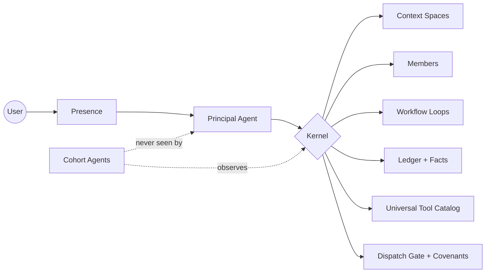

<div align="center">


# Kernos

**A personal agent that works around the clock and earns its keep one correct small action at a time.**

[](LICENSE)
[](https://www.python.org/downloads/)
[](#engineering-proof)
[](https://github.com/5000Stadia/Kernos/commits/main)
[](#project-status--v10-research-complete)

</div>

---

## What "Kernos" means

A *kernos* (κέρνος) is an ancient Greek ceremonial vessel: a central ring with several smaller cups attached around it, all fired as one piece. Worshippers brought offerings of different kinds — grain, oil, wine, milk, honey — each in its own cup, but the vessel held them together as one ritual whole.

The architecture mirrors the name. One central runtime holds many specialized surfaces around it — cohort agents, parallel context domains, multiple members, event-driven workflows, presence channels, tool registries, provider chains. Each cup keeps its specialization. The ring keeps them coherent.



---

## Why Kernos is different

Most personal-agent systems choose one of three shapes: a chat harness, a persistent memory scaffold, or a workflow runner. **Kernos is a kernel.** Memory, tools, members, workflows, safety, and presence are all first-class runtime surfaces — orchestrated around the principal agent, never inside its context.

- **Cohort architecture.** Bounded specialist LLM workers handle routing, gating, fact extraction, disclosure judgment, and friction observation around the principal. The principal never sees them; they never see each other. Judgment work on LLMs; state work in Python.
- **Parallel context domains.** Work, personal, project-X, research-sprint — each with its own memory, tool promotion, and compaction rhythm. One conversation, routed across many specialist threads, invisibly.
- **Multi-member runtime.** One install, multiple member identities, with welfare-aware judgment about cross-member disclosure. Your spouse *can* see your calendar; Kernos still makes a judgment about the therapy appointment.
- **Event-driven workflows.** Long-running loops triggered by events on the system stream, with bounded action sequences, approval gates, restart-resume, and portable `.workflow.yaml` descriptors that install like skills.
- **Infrastructure-level safety.** Tool calls pass through a dispatch gate that classifies effect and evaluates against user-declared covenants — with one deliberate exception: cross-member sends route through the Messenger cohort's welfare judgment instead, a stricter check than the gate. Safety as behavioral shaping, not access control.

---

## Project status — v1.0: research complete

Kernos was built as a **research project**: a working answer to the question
*"what does an agent substrate look like when memory, safety, honesty, and
self-maintenance are infrastructure rather than prompt text?"* — developed in
the open, operated live, and concluded deliberately at v1.0.

What v1 demonstrated, on a running system with receipts:

- **The full lived surface passes its own plain-English self-test** — 17
  end-to-end capability checks ([docs/V1-SELF-TEST.md](docs/V1-SELF-TEST.md))
  the agent executes against itself through its own tools, verified against
  the event stream rather than its own report.
- **The system ships reviewed improvements to itself.** Live on this repo: the
  running agent proposed and committed a diagnosability improvement to its own
  improvement loop; an external reviewer agent (Codex) found a real edge-case
  bug in it; a third agent fixed it — a three-AI maintenance loop with the
  human only at the approval gate.
- **A reusable set of named architectural principles** distilled from live
  failures and fixes: **[docs/DESIGN-PRINCIPLES.md](docs/DESIGN-PRINCIPLES.md)**
  — 15 portable patterns (Receipts-First Substrate, Narration-Audited
  Completion, The Typed Failure That Is Its Message, Hard Boundaries Inside
  Forgiveness, …) any agentic harness can adopt independently.

Identified-but-unbuilt directions are documented as **future research**, not
unfinished work: a self-calibration loop that mines the repair/failure event
stream for the model's own habits, per-turn tool-surface dieting, and the
continuous-cognition V2 below. The codebase is maintained at v1.0; issues and
discussion are welcome.

---

## What one Kernos holds

Multiple **context domains** · Multiple **members** · Multiple **event-driven workflows** · Multiple **cohorts** · Multiple **presence channels** · Multiple **tool surfaces** · Multiple **providers**

Not many agents in many threads. **One Kernos, many cups.**

---

## One agent, many domains

A typical agent session is one conversation thread that grows until it breaks. Spin up a second thread and you have two agents who don't know each other. Kernos runs **multiple parallel context spaces** per member — each with its own ledger, its own facts, its own promoted tool set, its own compaction rhythm.

Neither you nor the agent ever sees this happening. You keep one continuous conversation; the router weaves it into whichever specialized domain the topic belongs to. A single endless conversation, routed across many specialist threads, invisibly.

Switch between domains mid-conversation, come back an hour later, pick up where you left off — the agent holds the thread on both sides. The moment in most tools where you say *"I just talked about that, did you forget?"* doesn't happen here.

**100 domains in Kernos is better than 100 chat threads with one model.** 100 chat threads forget you and forget each other. Kernos specializes the cognition surface per-domain without siloing the person behind it.

**Deep dive:** [Context spaces →](docs/architecture/context-spaces.md)

---

## One Kernos, many members

Most personal-agent products give every user their own install. A household with three people running the same system has three siloed agents, three separate memory stores, three sets of credentials, and no awareness of each other. Kernos runs **one install holding multiple members** — partner and partner, parents and kids, a small team — each with their own hatched agent identity and memory thread, but all sitting inside one Kernos that knows the relationships between them.

A relationship matrix declares what each member can see of each other member's information. Permission alone isn't enough. A **Messenger cohort** sits above raw permissions and evaluates whether a particular disclosure serves the disclosing member's welfare in the moment. Identity is per-member; the runtime is shared.

**A household running on Kernos is one coherent system, not four parallel ones.** Privacy holds because disclosure is judged per-message; shared context flows because the runtime is unified.

**Deep dive:** [Multi-member disclosure layering →](docs/architecture/disclosure-and-messenger.md)

---

## One Kernos, many workflows

Most agent systems are reactive: you ask, the agent answers. Kernos has a workflow-loop primitive that lets the system **act between turns**, triggered by events on its event stream, running structured action sequences with verifiable bounds, pausing for human approval where the stakes warrant it, then resuming when approval lands.

A workflow has a **trigger** (an event on the system's stream), an **action sequence** (ordered steps composing seven bounded verbs), **approval gates** where they matter (each gate structurally bound to a specific paused execution by per-gate nonce — an unrelated approval can't bypass it; auto-proceed timeouts are forbidden across irreversible continuations), a **verifier** that checks intent satisfaction not just dispatch, and a **per-workflow ledger** any human or agent can read at a glance.

Workflows ship as portable `.workflow.yaml` files. **Authorable, shareable, installable like skills.** A new workflow is a new file plus a `register_workflow` call — not a code change, not a deploy.

The developing system itself runs through one of these workflows: the design review (Kernos) coordinates spec drafting, review, implementation, and approval as a multi-stage loop with human gates at design and push points. The same primitive can run a household morning briefing, a team status sweep, or a small business's invoicing pipeline.

**Kernos isn't only a thing you talk to. It's a thing that does work for you in the background, on schedules and triggers you set, with safety gates wherever they belong, and a ledger you can audit at any time.**

**Deep dive:** [Workflow loops →](docs/architecture/workflow-loops.md)

---

## Architectural contributions

|  |  |
| --- | --- |
| **Cohort architecture** | One principal agent surrounded by bounded specialist LLM workers. Judgment work on LLMs; state work in Python. The principal never sees a cohort; cohorts never see each other. |
| **Context spaces** | Parallel context spaces per member, each with its own memory, tool promotion, and compaction boundary. Invisible to user and agent — a single conversation routes transparently across specialist domains. |
| **Dual memory: Ledger + Facts** | Two stores, two jobs. **Ledger** holds the conversational arc, compressed at compaction boundaries rather than turn-by-turn. **Facts** holds structured knowledge, reconciled in a single LLM call against the existing store. Lossless narrative retrieval and deduplicated fact supersession, both at once. |
| **Multi-member disclosure layering** | One hatched agent per member, not per install. A relationship matrix declares permissions; a Messenger cohort sits above permissions and evaluates whether a response serves the disclosing member's welfare. |
| **Workflow loops** | Event-triggered substrate for action sequences that run between turns. Bounded action verbs; approval gates with per-execution nonce binding; auto-proceed forbidden across irreversible continuations. Portable `.workflow.yaml` descriptors — authorable, shareable, installable like skills. |
| **Infrastructure-level safety** | Tool calls pass through a gate that classifies effect (`read` / `soft_write` / `hard_write`) and evaluates against user-declared covenants. Reactive soft-writes pass; hard-writes gate; non-reactive paths gate. Covenant violations surface as conflicts the agent must resolve — not as silent denials. |
| **Cognitive UI grammar** | The system prompt as a typed document with named zones — RULES, ACTIONS, NOW, STATE, RESULTS, PROCEDURES, MEMORY — cacheable prefix, provenance tags on every knowledge fragment. Selective zone refresh without rebuilding the prompt. |

---

## Capability surface

|  |  |
| --- | --- |
| **Multi-channel presence** | Discord, SMS via Twilio, Telegram. One handler, one identity across channels. Adding a new platform is ~150 lines. |
| **Agentic workspace** | The agent writes Python in a subprocess with best-effort isolation (clean env, scoped cwd, restricted PYTHONPATH), exercises it live, and registers it as a first-class tool in the universal catalog. 50-line helpers, not frameworks. |
| **Self-directed execution** | `manage_plan` creates multi-phase plans with budget ceilings. Three-tier resilience: provider failover, step retries with exponential backoff, hourly slow-poll. Plans survive restarts. |
| **Event-driven workflows** | Long-running workflow loops triggered by events on the stream, with bounded action sequences, approval gates, per-execution nonce binding, restart-resume, and portable descriptors. |
| **Friction-driven improvement** | A friction observer watches the turn trace. When patterns emerge — repeated failures, recurring confusions, missing primitives — the system proposes covenant changes and concrete spec drafts grounded in live evidence. |
| **Provider flexibility** | Anthropic, OpenAI Codex, or Ollama behind a `Provider` ABC. Two named fallback chains — `primary` / `lightweight` (legacy `simple`/`cheap` names alias to `lightweight`). Swap providers without touching the agent. |

---

## Capability status

Honest status of every major surface, sourced from `kernos/kernel/capabilities.py` (the same list the `/capabilities` slash command reads). The README copy is regenerated when the canonical list changes; if these drift, the in-code list wins.

| Capability | Status | What it gives | Notes |
| --- | --- | --- | --- |
| Messaging adapters | Live | Conversational turns over Discord, Twilio SMS, Telegram, and CLI | Discord-native slash commands (e.g. /debug); text commands universal across adapters |
| Workspace code execution | Live | Agent writes Python in a subprocess with best-effort isolation; registers tools | Best-effort isolation, not a hard sandbox; hostile code can escape via ctypes |
| Builder: Aider | Live | code_exec(backend='aider') hands task-shaped CLI work to Aider | Build mode only; consult is unsupported |
| External-agent consultation | Live | Agent invokes Claude Code / Codex / Gemini for review or task delegation | consult tool + code_exec(backend=...); reentrancy guard scopes by calling context |
| Memory recall + compaction | Live | remember tool over accumulated knowledge; ledger + facts + personality at compaction | Bjork dual-strength ranking; FTS5 over event stream parked for follow-on |
| Workflow loops (WLP) | Live | Approval-gated workflow execution, restart-resume, action library | — |
| AgentInbox | Live | Workflow route_to_agent verb persists into the AgentInbox | Provider unavailability surfaces as typed AgentInboxUnavailable |
| Scheduler + triggers | Live | Time-based + event-driven trigger evaluation; manage_schedule tool | — |
| Cohort: Drafter v2 | Live | Tool-starved cohort that consumes shared context surfaces and proposes drafts | — |
| Cohort: Friction Observer | Live | Post-turn signal detection for friction patterns + diagnostic reports | — |
| Cohort: Stewardship + sensitivity | Live | Value extraction + tension detection at compaction; sensitivity classification at harvest | — |
| Event stream durability | Live | Per-instance SQLite event stream with flush + graceful-shutdown guarantees | Durable after flush; up to 2 seconds of in-flight events lost on ungraceful crash |
| Multi-member identity | Live | Per-member profiles, spaces, conversations, hatching, relationships | — |
| Decoupled turn runner | Partial | Thin-path turns succeed; full-machinery dispatch awaits workshop binding | INTEGRATION-WIRE-LIVE-WORKSHOP-BINDING follow-up; loud-error placeholders mark the seam |
| Domain pass | Planned | Agent or workflow acts inside another space without the user manually entering it | KERNOS-DOMAIN-PASS v1 follow-on spec |

---

## Docs

- **[Design principles](docs/DESIGN-PRINCIPLES.md)** — 17 named, portable architectural patterns derived from live operation; the intellectual core of the project.
- **[Canonical introduction](docs/kernos-introduction.md)** — what the running agent reaches when asked what Kernos is. Innovation overview plus a navigable map.
- **[Architecture overview](docs/architecture/overview.md)** · **[Pipeline reference](docs/architecture/pipeline-reference.md)** · **[Primitives reference](docs/architecture/primitives-reference.md)**
- **[Cohort architecture](docs/architecture/cohort-and-judgment.md)** · **[Context spaces](docs/architecture/context-spaces.md)** · **[Memory](docs/architecture/memory.md)**
- **[Multi-member disclosure](docs/architecture/disclosure-and-messenger.md)** · **[Workflow loops](docs/architecture/workflow-loops.md)** · **[Infrastructure safety](docs/architecture/safety-and-gate.md)** · **[Cognitive UI](docs/architecture/cognitive-ui.md)**
- **[Design frames](docs/design-frames/)** · **[Roadmap](docs/roadmap.md)** · **[V2 direction](docs/v2/direction.md)**

**For technical reviewers:** start with this README, then [Architecture overview](docs/architecture/overview.md) → [Workflow loops](docs/architecture/workflow-loops.md) → [Infrastructure safety](docs/architecture/safety-and-gate.md) → [Memory](docs/architecture/memory.md) and [Context spaces](docs/architecture/context-spaces.md).

---

## Quick install

```bash
git clone https://github.com/5000Stadia/Kernos.git
cd Kernos
python3.11 -m venv .venv && source .venv/bin/activate
pip install -e .
cp .env.example .env   # fill in API keys
python kernos/server.py
```

Requires Python 3.11+, an LLM API key (Anthropic, OpenAI/Codex, or Ollama), and at least one messaging adapter credential (Discord token, Twilio, or Telegram bot token). Node.js is required for MCP servers that run via `npx`.

**[Full install guide →](docs/install.md)**

---

## Engineering proof

- **7,000+ test functions across 384 test files** (canonical passing counts tracked per-phase in [`DECISIONS.md`](DECISIONS.md)) — with structural pin tests for invariants (multi-tenancy keying, no-destructive-deletions, gate-bypass resistance, action-loop pattern compliance) and substrate-fidelity tests that assert on receipts and state, not just return values.
- **Live-verified, not just unit-tested.** The plain-English self-test ([docs/V1-SELF-TEST.md](docs/V1-SELF-TEST.md)) runs against the production agent through its own tool surface; results are verified against the event stream. The dispatch-reliability stack (typed failures, signature presentation, argument repair, step-completion auditing) was built from failures this test surfaced on the running system.
- **Durable per-instance event stream** backed by SQLite, with `instance_id` / `member_id` / `space_id` / `correlation_id` schema and a post-flush hook contract for trigger registries that doesn't poison event persistence on workflow code failure.
- **Workflow primitive with approval gates** — per-gate nonce binding so an approval can't wake an unintended execution; restart-resume per workflow descriptor with conservative default; safe-deny on `auto_proceed_with_default` for irreversible post-gate continuations.
- **Local/test-provider containment** for live test sweeps so edge-case observation doesn't produce accidental public side effects.
- **Spec-first development** with multi-round substrate-correctness review and code-correctness review on every batch. Six real correctness bugs caught during the workflow-loop primitive batch (WLP); seven more during the gate-scoping batch that followed (WLP-GS) — every one before it shipped.
- **Self-hosted single-host orchestrator with subprocesses.** No managed cloud. Your data stays on your hardware.

---

## V2 direction

V1 is a reactive runtime with ambient extensions and event-driven workflows. V2 inverts the shape: a continuous **Cognition Kernel** running per member, maintaining a structured **World Model** across fused streams (conversation, calendar, email, location, plan state), running idle-cycle reflection and projection passes, surfacing through a single aggressive relevance filter. Turns become privileged consumers of a running process rather than the engine itself.

V1's covenant system, dispatch gate, Messenger cohort, sensitivity classification, workflow-loop substrate, and stewardship are the alignment fabric a continuous-cognition layer needs to stay trustworthy. **V1 is the alignment substrate; V2 is the cognition layer built on it.**

**[V2 direction →](docs/v2/direction.md)** · **[Alignment substrate →](docs/v2/alignment-substrate.md)**

---

## License

MIT — see [LICENSE](LICENSE). Built by [@5000Stadia](https://github.com/5000Stadia).

---

*The agent thinks. The kernel remembers, notices, routes, and protects.*
